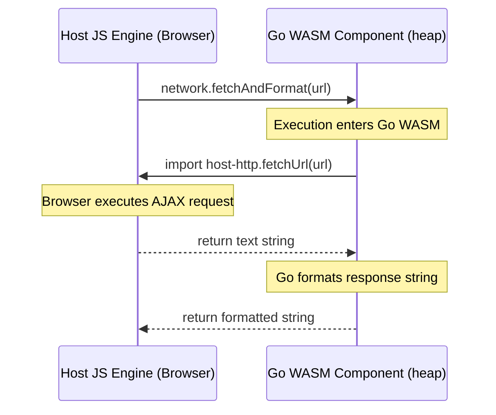

# Live WASI V2 Browser Demo

Below is a live, interactive execution of our actual **WASI Preview 2 Go Component** running directly inside your browser. No server side, no child processes. It instantiates the Go virtual machine in memory, executes rich object-oriented geometry operations, and persists keys inside a stateful Go database.

---

## ⚡ Interactive Playground

<!-- 1. Include the native W3C Import Map to resolve V2 shims to CDNs -->
<script type="importmap">
{
  "imports": {
    "@bytecodealliance/preview2-shim/cli": "https://esm.sh/@bytecodealliance/preview2-shim/cli",
    "@bytecodealliance/preview2-shim/clocks": "https://esm.sh/@bytecodealliance/preview2-shim/clocks",
    "@bytecodealliance/preview2-shim/filesystem": "https://esm.sh/@bytecodealliance/preview2-shim/filesystem",
    "@bytecodealliance/preview2-shim/io": "https://esm.sh/@bytecodealliance/preview2-shim/io",
    "@bytecodealliance/preview2-shim/random": "https://esm.sh/@bytecodealliance/preview2-shim/random"
  }
}
</script>

<div style="display: grid; grid-template-columns: 1fr 1fr; gap: 20px; margin: 2rem 0; font-family: sans-serif;">
    
    <!-- Column 1: Stateful KV Store (Go WASM Memory Heap) -->
    <div style="padding: 1.5rem; background: var(--md-code-bg-color, #f8f9fa); border: 1px solid var(--md-typeset-table-color, #eaeaea); border-radius: 8px; box-shadow: 0 4px 10px rgba(0,0,0,0.02);">
        <h3 style="margin-top: 0; color: #2c3e50; border-bottom: 2px solid #3498db; padding-bottom: 0.5rem;">Stateful KV-Store (Go Memory Heap)</h3>
        <p style="font-size: 0.85rem; color: #555; line-height: 1.4;">This widget instantiates a new <code>KVStore</code> Go resource. Values are saved inside Go's linear memory heap between calls.</p>
        
        <div style="margin-bottom: 1rem;">
            <label style="display:block; font-size:0.8rem; font-weight:bold; margin-bottom:4px;">Write Key/Value:</label>
            <div style="display:flex; gap: 8px;">
                <input type="text" id="kv-key" placeholder="username" style="padding: 6px; border: 1px solid #ccc; border-radius: 4px; flex: 1;" />
                <input type="text" id="kv-val" placeholder="gpineda" style="padding: 6px; border: 1px solid #ccc; border-radius: 4px; flex: 1;" />
                <button id="btn-kv-set" style="padding: 6px 12px; background: #3498db; color: white; border: none; border-radius: 4px; cursor: pointer; font-weight: bold;">Set</button>
            </div>
        </div>
        
        <div style="margin-bottom: 1rem;">
            <label style="display:block; font-size:0.8rem; font-weight:bold; margin-bottom:4px;">Read Key:</label>
            <div style="display:flex; gap: 8px;">
                <input type="text" id="kv-search-key" placeholder="username" style="padding: 6px; border: 1px solid #ccc; border-radius: 4px; flex: 1;" />
                <button id="btn-kv-get" style="padding: 6px 12px; background: #2ecc71; color: white; border: none; border-radius: 4px; cursor: pointer; font-weight: bold;">Get</button>
            </div>
        </div>

        <div style="background: white; padding: 10px; border: 1px solid #ddd; border-radius: 4px; min-height: 50px;">
            <div id="kv-output" style="font-size: 0.9rem; font-family: monospace; color: #333; word-break: break-all;">Awaiting input...</div>
        </div>
    </div>

    <!-- Column 2: OOP Geometry & Lang Tools -->
    <div style="padding: 1.5rem; background: var(--md-code-bg-color, #f8f9fa); border: 1px solid var(--md-typeset-table-color, #eaeaea); border-radius: 8px; box-shadow: 0 4px 10px rgba(0,0,0,0.02);">
        <h3 style="margin-top: 0; color: #2c3e50; border-bottom: 2px solid #e74c3c; padding-bottom: 0.5rem;">OOP Geometry & Lang exports</h3>
        <p style="font-size: 0.85rem; color: #555; line-height: 1.4;">Calls exported Go structs. Values are mapped on-the-fly from JavaScript objects to WASM memory records.</p>
        
        <div style="margin-bottom: 1rem;">
            <label style="display:block; font-size:0.8rem; font-weight:bold; margin-bottom:4px;">Point 1 (X, Y) & Point 2 (X, Y):</label>
            <div style="display:flex; gap: 8px; align-items:center;">
                <input type="number" id="p1-x" value="0" style="padding: 6px; border: 1px solid #ccc; border-radius: 4px; width: 60px; text-align: center;" />
                <input type="number" id="p1-y" value="0" style="padding: 6px; border: 1px solid #ccc; border-radius: 4px; width: 60px; text-align: center;" />
                <span style="font-weight:bold;">→</span>
                <input type="number" id="p2-x" value="3" style="padding: 6px; border: 1px solid #ccc; border-radius: 4px; width: 60px; text-align: center;" />
                <input type="number" id="p2-y" value="4" style="padding: 6px; border: 1px solid #ccc; border-radius: 4px; width: 60px; text-align: center;" />
            </div>
        </div>

        <div style="margin-bottom: 1rem;">
            <label style="display:block; font-size:0.8rem; font-weight:bold; margin-bottom:4px;">Format message for name:</label>
            <div style="display:flex; gap: 8px;">
                <input type="text" id="lang-name" value="Developer" style="padding: 6px; border: 1px solid #ccc; border-radius: 4px; flex: 1;" />
                <button id="btn-geom" style="padding: 6px 12px; background: #e74c3c; color: white; border: none; border-radius: 4px; cursor: pointer; font-weight: bold;">Run Tools</button>
            </div>
        </div>

        <div style="background: white; padding: 10px; border: 1px solid #ddd; border-radius: 4px; min-height: 50px;">
            <div id="geom-output" style="font-size: 0.85rem; line-height: 1.4; color: #333;">Awaiting execution...</div>
        </div>
    </div>
</div>

<!-- Row 2: Full width Network Delegation Card -->
<div style="padding: 1.5rem; background: var(--md-code-bg-color, #f8f9fa); border: 1px solid var(--md-typeset-table-color, #eaeaea); border-radius: 8px; box-shadow: 0 4px 10px rgba(0,0,0,0.02); margin-bottom: 2rem; font-family: sans-serif;">
    <h3 style="margin-top: 0; color: #2c3e50; border-bottom: 2px solid #9b59b6; padding-bottom: 0.5rem;">Delegated Host HTTP Client (imported capability)</h3>
    <p style="font-size: 0.85rem; color: #555; line-height: 1.4;">
        Go WASM does not have raw socket network access inside the sandbox. When calling <code>network.fetchAndFormat()</code>, Go delegates the request to the host. The browser's JS engine fetches the URL and returns the text, which Go formats and returns.
    </p>
    
    <div style="margin-bottom: 1rem;">
        <label style="display:block; font-size:0.8rem; font-weight:bold; margin-bottom:4px;">Fetch URL:</label>
        <div style="display:flex; gap: 8px;">
            <input type="text" id="net-url" value="https://raw.githubusercontent.com/project-ouvrage/metadata/main/ping.txt" style="padding: 6px; border: 1px solid #ccc; border-radius: 4px; flex: 1;" />
            <button id="btn-net" style="padding: 6px 12px; background: #9b59b6; color: white; border: none; border-radius: 4px; cursor: pointer; font-weight: bold;">Fetch & Format</button>
        </div>
    </div>

    <div style="background: white; padding: 10px; border: 1px solid #ddd; border-radius: 4px; min-height: 50px;">
        <div id="net-output" style="font-size: 0.85rem; line-height: 1.4; color: #333; font-family: monospace; white-space: pre-wrap; word-break: break-all;">Awaiting fetch request...</div>
    </div>
</div>

<div id="global-status" style="font-weight: bold; color: #7f8c8d; text-align: center; margin: 1rem 0;">
    Loading WASI V2 Component engine...
</div>

---

## 🛠️ The Implementation Mechanics



### Browser Compatibility Notes
Because the V2 Component loading is fully compliant with modern standards, it runs natively inside the web thread. It uses an **Import Map** to map WASI system calls to CDN polyfills and loads the transpiled ES Modules using standard async imports:

```javascript
// Dynamic import from the static assets copied inside the documentation
import { geometry, KVStore, lang, network } from '../js/v2/my_lib/index.js';
```

---

<script type="module">
    // Load V2 Component relatively from docs static assets
    let libModule = null;
    let dbInstance = null;

    async function initWasm() {
        const statusEl = document.getElementById('global-status');
        try {
            // Relative URL from '/live-demo/' output dir to '/js/v2/my_lib/index.js'
            const moduleUrl = '../js/v2/my_lib/index.js';
            libModule = await import(moduleUrl);
            
            // Instantiate the database
            dbInstance = new libModule.KVStore();
            
            statusEl.innerText = "⚡ WASI V2 Engine Loaded (Go WASM running in-process)";
            statusEl.style.color = "#2ecc71";
            
            // Run geometry initially
            runGeometry();
        } catch (err) {
            statusEl.innerHTML = `<span style="color: #e74c3c;">Failed to initialize WASM Component: ${err.message}</span>`;
            console.error("WASM Load Error:", err);
        }
    }

    async function runGeometry() {
        if (!libModule) return;
        const outEl = document.getElementById('geom-output');
        try {
            const x1 = parseFloat(document.getElementById('p1-x').value) || 0;
            const y1 = parseFloat(document.getElementById('p1-y').value) || 0;
            const x2 = parseFloat(document.getElementById('p2-x').value) || 0;
            const y2 = parseFloat(document.getElementById('p2-y').value) || 0;
            const name = document.getElementById('lang-name').value || "";

            const p1 = new libModule.geometry.Point(x1, y1);
            const p2 = new libModule.geometry.Point(x2, y2);
            
            const dist = await p1.distanceTo(p2);
            const rect = new libModule.geometry.Rectangle(p1, p2);
            const area = await rect.area();
            
            const welcome = await libModule.lang.formatMessage(name);

            outEl.innerHTML = `
                <strong>p1.distanceTo(p2) :</strong> ${dist.toFixed(4)}<br/>
                <strong>rect.area() :</strong> ${area.toFixed(4)}<br/>
                <strong>lang.formatMessage() :</strong> "${welcome}"
            `;
        } catch (err) {
            outEl.innerHTML = `<span style="color: red;">Error: ${err.message}</span>`;
        }
    }

    async function setKV() {
        if (!dbInstance) return;
        const outEl = document.getElementById('kv-output');
        const key = document.getElementById('kv-key').value;
        const val = document.getElementById('kv-val').value;
        if (!key) {
            outEl.innerText = "Error: Key cannot be empty";
            return;
        }
        try {
            outEl.innerText = "Writing to Go memory...";
            await dbInstance.set(key, val);
            outEl.innerText = `Success: Saved "${key}" = "${val}" inside Go memory!`;
            document.getElementById('kv-key').value = "";
            document.getElementById('kv-val').value = "";
        } catch (err) {
            outEl.innerHTML = `<span style="color: red;">Error: ${err.message}</span>`;
        }
    }

    async function getKV() {
        if (!dbInstance) return;
        const outEl = document.getElementById('kv-output');
        const key = document.getElementById('kv-search-key').value;
        if (!key) {
            outEl.innerText = "Error: Search key cannot be empty";
            return;
        }
        try {
            outEl.innerText = "Reading from Go memory...";
            const val = await dbInstance.get(key);
            if (val === null || val === undefined) {
                outEl.innerText = `Result: Key "${key}" not found (returned nil).`;
            } else {
                outEl.innerText = `Result: Key "${key}" = "${val}" (fetched from Go heap)`;
            }
        } catch (err) {
            outEl.innerHTML = `<span style="color: red;">Error: ${err.message}</span>`;
        }
    }

    async function runNetwork() {
        if (!libModule) return;
        const outEl = document.getElementById('net-output');
        const url = document.getElementById('net-url').value;
        if (!url) {
            outEl.innerText = "Error: URL cannot be empty";
            return;
        }
        try {
            outEl.innerText = "Delegating HTTP request to host browser...";
            const result = await libModule.network.fetchAndFormat(url);
            outEl.innerText = result;
        } catch (err) {
            outEl.innerHTML = `<span style="color: red;">Error: ${err.message}</span>`;
        }
    }

    // Attach events
    document.getElementById('btn-geom').addEventListener('click', runGeometry);
    document.getElementById('btn-kv-set').addEventListener('click', setKV);
    document.getElementById('btn-kv-get').addEventListener('click', getKV);
    document.getElementById('btn-net').addEventListener('click', runNetwork);

    // Boot WASM
    initWasm();
</script>
