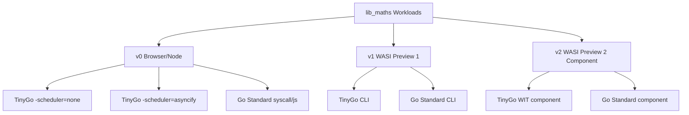

# 🔬 Benchmark Protocol & Scenario Specifications

This document defines the core benchmarking environment, the toolchain matrix, the FFI invocation protocol, and the detailed mathematical scenarios used in this laboratory.

!!! info "Why Exclude Complex WIT Structures (Records) from Benchmarks?"
    WebAssembly v0 MVP has no concept of high-level structures, records, or strings; it operates strictly on primitive types (`i32`, `i64`, `f32`, `f64`). 
    
    If we included complex WIT components (records, lists, variants) in these performance benchmarks, WASM v0 would require manual pointer manipulation (`malloc`, offset-based writes, `free`) on the host side. This implementation delta and serialization overhead would pollute the metrics.
    
    By restricting the benchmark to pure scalar mathematics (`lib_maths`), we ensure a clean, identical baseline to compare the execution speed of the virtual machines themselves from `v0` up to `v2` without external noise.

---

## 1. Workload Scenario Descriptions

We selected six functions from our Go codebase to capture different aspects of CPU workloads, stack limits, and compiler passes. The table below outlines their mathematical models and system focus tags. Click on a function's reference to view its detailed mathematical equations, system targets, and multi-language implementation code in [Section 6](#6-workload-implementation-code-reference).

| Go Function | Mathematical Model | System Focus (Tags) | Detailed Code & Math Reference |
| :--- | :--- | :--- | :--- |
| **`Add`** | $f(a, b) = a + b$ | `#ffi-overhead` `#latency` | [See Section 6](#add-fa) |
| **`ComputeSequence`** | $U_n = U_0 + n \times b$ | `#loop-induction` `#compiler-scev` | [See Section 6](#computesequence-fb) |
| **`FindLastPrime`** | $P_{max} \le limit$ | `#cpu-bound` `#trial-division` | [See Section 6](#findlastprime-fc) |
| **`ConcurrentCountPrimes`** | $\sum P_i$ partitioned | `#multithreading` `#scheduler` | [See Section 6](#concurrentcountprimes-fd) |
| **`Fibonacci`** | $F_n$ ($O(N)$ linear) | `#register-loop` `#fast-arithmetic` | [See Section 6](#fibonacci-fe) |
| **`FibonacciRecursive`** | $F_n$ ($O(2^N)$ recursive) | `#stack-depth` `#recursion-cost` | [See Section 6](#fibonaccirecursive-ff) |

---

## 2. Pure Host Baselines (JS & Python Controls)

To establish a strict scientific comparison, the exact mathematical logic of `pkg/maths/maths.go` is duplicated line-for-line in host-native languages:
* Pure JavaScript: [`bindings/my_lib_maths/js/pkg/maths.js`](file:///home/gpineda/Documents/ouvrage/labs/wasi-polyglot-bindings-reference/bindings/my_lib_maths/js/pkg/maths.js) (executing inside the V8 JIT compiler engine).
* Pure Python: `bindings/my_lib_maths/py/pkg/maths.py` (executing inside the CPython interpreter, with future comparisons targeting NumPy and Numba JIT).

---

## 3. FFI Boundary & Invocation Protocol

We introduce a core architectural distinction in how WebAssembly is executed from the host language:

```text
                           ┌──► WASM Internal (1 FFI Call - executes loop inside WASM)
                           │
FFI Invocation Protocol ───┼──► N Calls WASM Cached (1 Instantiation -> N FFI calls in JS loop)
                           │
                           └──► N Calls WASM Cold (N Instantiations -> N FFI calls, new instance each)
```

1. **`WASM Internal` (1 Call - Full Speed)**:
   The host language makes a single FFI call to a high-level WASM function (e.g. `FindLastPrime(limit)`). The entire loop execution happens inside the WebAssembly linear memory space.

2. **`N Calls WASM (Cached Instance)`**:
   The host language instantiates the WebAssembly module once. Then, a loop in the host language makes $N$ separate FFI calls, delegating each atomic step (e.g., calling `Add` $N$ times) to the guest WASM.

3. **`N Calls WASM (Cold Re-Instantiation)`**:
   At each step of the loop, the host language completely compiles, instantiates, and executes the WebAssembly module from scratch before calling the function.

---

## 4. Environment & Target Matrix

The laboratory evaluates mathematical workloads across different compilation environments and target versions to compile a multi-dimensional performance matrix:



### v0 Target (Browser / Node FFI)
* **TinyGo (No Scheduler)**: High-speed scalar executions, extremely lightweight (~99 KB binary). Any attempt to allocate goroutine closures fails at compile time or triggers safety stubs.
* **TinyGo (Asyncify)**: Integrates the coroutine scheduler (~133 KB binary). While it includes scheduler logic, calling goroutines from host FFI triggers `nilPanic` due to missing GC task contexts.
* **Standard Go (Legacy)**: Large binary (~1.8 MB) containing the complete Go runtime and scheduling thread loop. Goroutines and channels run natively on the host event loop.

---

## 5. Benchmark Configuration Nomenclature (Alias Codes)

To uniquely refer to any target runtime run configuration in raw data reports, console output logging, and meeting minutes, we establish a standardized **four-character alphanumeric code system (Nomenclature)**.

Every run configuration is represented by the pattern: `[V][L][F][M]`

### A. Version & Guest Toolchain (V)

| V | Target Interface | Compiler / Runtime | Build Options / Details |
| :---: | :--- | :--- | :--- |
| **`A`** | v0 (Web) | TinyGo | `-scheduler=none` |
| **`B`** | v0 (Web) | TinyGo | `-scheduler=asyncify` |
| **`C`** | v0 (Web) | Standard Go | `syscall/js` API |
| **`D`** | WASI v1 | TinyGo | CLI Target |
| **`E`** | WASI v1 | Standard Go | CLI Target |
| **`F`** | WASI v2 | TinyGo | Component Model (WIT Canonical ABI) |
| **`G`** | WASI v2 | Standard Go | Component Model (WIT Canonical ABI) |
| **`H`** | N/A (Host) | Pure Native | Host Engine (V8 / CPython) |


### B. Host Language / Runner (L)
* **`1`** = JavaScript (Web Browser / Node.js V8)
* **`2`** = Python (CPython Interpreter)
* **`3`** = Go Native (Cobra CLI `omaths-bench`)

### C. Go Math Function (F)
* **`A`** = `Add`
* **`B`** = `ComputeSequence`
* **`C`** = `FindLastPrime`
* **`D`** = `ConcurrentCountPrimes`
* **`E`** = `Fibonacci`
* **`F`** = `FibonacciRecursive`

### D. FFI / Invocation Mode (M)
* **`1`** = `WASM Internal` (Single FFI call, loop executes entirely inside guest)
* **`2`** = `Pure Host JIT/Interpreter` (No WebAssembly involved)
* **`3`** = `N Calls WASM (Cached Instance)` (Host loop driving warm guest)
* **`4`** = `N Calls WASM (Cold Re-Instantiation)` (Host loop compiling guest every iteration)

---

### Nomenclature Examples
* **`A1B1`** : WASM v0 TinyGo (`A`), JavaScript Browser (`1`), running `ComputeSequence` (`B`), inside `WASM Internal` (`1`) execution.
* **`C1D1`** : WASM v0 Legacy Standard Go (`C`), JavaScript Node.js (`1`), running `ConcurrentCountPrimes` (`D`), in `WASM Internal` (`1`) mode.
* **`H2C2`** : Pure Host Python Control (`H`), Python (`2`), executing the sequential `FindLastPrime` algorithm (`C`), in `Pure Host JIT/Interpreter` (`2`) mode.

---

## 6. Workload Implementation & Code Reference

This section provides the complete reference implementation in Go, JavaScript, and Python, alongside the FFI cached and cold execution runner loops for each workload function.

### Add (F=A)

* **Mathematical Model**:
  $$
  f(a, b) = a + b
  $$
* **System Target**: This operation performs no intensive calculations. Its execution time isolates the raw boundary-crossing cost of FFI calls between the host language (JS/Python) and the WebAssembly linear memory space.
* **Go Source Code**:
```go
func Add(a, b int64) int64 {
    return a + b
}
```

* **JavaScript (JS) Environment**:

=== "Pure"
    * **Nomenclature Alias**: `H1A2`
    ```javascript
    export function jsAdd(a, b) {
      return BigInt(a) + BigInt(b);
    }
    ```
=== "FFI Cached"
    * **Nomenclature Alias**: `A1A3` (v0 TinyGo JS Cached)
    ```javascript
    // Instantiated once, called repeatedly in host loop
    for (let i = 0; i < count; i++) {
      res = wasmInstance.exports.Add(15, 35);
    }
    ```
=== "FFI Cold"
    * **Nomenclature Alias**: `A1A4` (v0 TinyGo JS Cold)
    ```javascript
    // Instantiated and executed from scratch at each step
    for (let i = 0; i < count; i++) {
      const { instance } = await WebAssembly.instantiate(wasmBytecode, imports);
      res = instance.exports.Add(15, 35);
    }
    ```

* **Python (Py) Environment**:

=== "Pure"
    * **Nomenclature Alias**: `H2A2`
    ```python
    # TODO: Python control baseline implementation
    ```
=== "FFI Cached"
    * **Nomenclature Alias**: `D2A3` (v1 TinyGo Py Cached)
    ```python
    # TODO: Python FFI Cached runner
    ```
=== "FFI Cold"
    * **Nomenclature Alias**: `D2A4` (v1 TinyGo Py Cold)
    ```python
    # TODO: Python FFI Cold runner
    ```

### ComputeSequence (F=B)

* **Mathematical Model**:
  $$
  U_n = U_0 + \sum_{i=0}^{n-1} b
  $$
* **System Target**: Designed to trap the compiler. We measure the ability of LLVM (via TinyGo) to analyze loop induction invariants (Scalar Evolution - SCEV) and eliminate the loop entirely, replacing it with a constant-time $O(1)$ multiplication and addition.
* **Go Source Code**:
```go
func ComputeSequence(u0, b, n int64) int64 {
    curr := u0
    for i := int64(0); i < n; i++ {
        curr = Add(curr, b)
    }
    return curr
}
```

* **JavaScript (JS) Environment**:

=== "Pure"
    * **Nomenclature Alias**: `H1B2`
    ```javascript
    export function jsComputeSequence(u0, b, n) {
      let curr = BigInt(u0);
      const step = BigInt(b);
      const count = BigInt(n);
      for (let i = 0n; i < count; i++) {
        curr += step;
      }
      return curr;
    }
    ```
=== "FFI Cached"
    * **Nomenclature Alias**: `A1B3` (v0 TinyGo JS Cached)
    ```javascript
    // Loop driven by the host calling guest FFI
    for (let i = 0; i < count; i++) {
      res = wasmInstance.exports.ComputeSequence(15, 35, N);
    }
    ```
=== "FFI Cold"
    * **Nomenclature Alias**: `A1B4` (v0 TinyGo JS Cold)
    ```javascript
    // Instantiated and executed from scratch inside the loop
    for (let i = 0; i < count; i++) {
      const { instance } = await WebAssembly.instantiate(wasmBytecode, imports);
      res = instance.exports.ComputeSequence(15, 35, N);
    }
    ```

* **Python (Py) Environment**:

=== "Pure"
    * **Nomenclature Alias**: `H2B2`
    ```python
    # TODO: Python control baseline implementation
    ```
=== "FFI Cached"
    * **Nomenclature Alias**: `D2B3` (v1 TinyGo Py Cached)
    ```python
    # TODO: Python FFI Cached runner
    ```
=== "FFI Cold"
    * **Nomenclature Alias**: `D2B4` (v1 TinyGo Py Cold)
    ```python
    # TODO: Python FFI Cold runner
    ```

### FindLastPrime (F=C)

* **Mathematical Model**:
  $$
  P_{max} = \max(\{p \in \mathbb{N} \mid p \le limit \text{ and } p \text{ is prime}\})
  $$
* **System Target**: A strict CPU-bound sequential trial division stress test ($O(\sqrt{limit})$). Because it cannot be simplified by compile-time algebraic passes, it forces the WASM CPU to execute all loop iterations sequentially.
* **Go Source Code**:
```go
func FindLastPrime(limit int64) int64 {
    last := int64(0)
    for i := int64(2); i <= limit; i++ {
        if IsPrime(i) {
            last = i
        }
    }
    return last
}
```

* **JavaScript (JS) Environment**:

=== "Pure"
    * **Nomenclature Alias**: `H1C2`
    ```javascript
    export function jsFindLastPrime(limit) {
      let last = 0n;
      const max = BigInt(limit);
      for (let i = 2n; i <= max; i++) {
        if (jsIsPrime(i)) last = i;
      }
      return last;
    }
    ```
=== "FFI Cached"
    * **Nomenclature Alias**: `A1C3` (v0 TinyGo JS Cached)
    ```javascript
    for (let i = 0; i < count; i++) {
      res = wasmInstance.exports.FindLastPrime(limit);
    }
    ```
=== "FFI Cold"
    * **Nomenclature Alias**: `A1C4` (v0 TinyGo JS Cold)
    ```javascript
    for (let i = 0; i < count; i++) {
      const { instance } = await WebAssembly.instantiate(wasmBytecode, imports);
      res = instance.exports.FindLastPrime(limit);
    }
    ```

* **Python (Py) Environment**:

=== "Pure"
    * **Nomenclature Alias**: `H2C2`
    ```python
    # TODO: Python control baseline implementation
    ```
=== "FFI Cached"
    * **Nomenclature Alias**: `D2C3` (v1 TinyGo Py Cached)
    ```python
    # TODO: Python FFI Cached runner
    ```
=== "FFI Cold"
    * **Nomenclature Alias**: `D2C4` (v1 TinyGo Py Cold)
    ```python
    # TODO: Python FFI Cold runner
    ```

### ConcurrentCountPrimes (F=D)

* **Mathematical Model**:
  $$
  \text{Count}(p \in [2..limit]) = \sum_{w=0}^{K-1} \text{Count}_w
  $$
* **System Target**: Evaluates concurrency models. It tests the coroutine scheduler (Go/TinyGo task engine) and synchronizing channels over workers processing chunks of the search range.
* **Go Source Code**:
```go
func ConcurrentCountPrimes(limit int64, numWorkers int) int64 {
    if limit < 2 {
        return 0
    }
    if numWorkers <= 1 {
        return CountPrimes(limit)
    }
    results := make(chan int64, numWorkers)
    chunkSize := (limit - 1) / int64(numWorkers)
    for w := 0; w < numWorkers; w++ {
        start := int64(2) + int64(w)*chunkSize
        end := start + chunkSize - 1
        if w == numWorkers-1 {
            end = limit
        }
        go func(s, e int64) {
            var count int64
            for i := s; i <= e; i++ {
                if IsPrime(i) {
                    count++
                }
            }
            results <- count
        }(start, end)
    }
    var total int64
    for w := 0; w < numWorkers; w++ {
        total += <-results
    }
    return total
}
```

* **JavaScript (JS) Environment**:

=== "Pure"
    * **Nomenclature Alias**: `H1D2`
    ```javascript
    export async function jsConcurrentCountPrimes(limit, workers = 4) {
      const max = BigInt(limit);
      const numWorkers = Math.max(1, workers);
      const chunkSize = (max - 1n) / BigInt(numWorkers);
      const tasks = [];
      for (let w = 0; w < numWorkers; w++) {
        const start = 2n + BigInt(w) * chunkSize;
        const end = (w === numWorkers - 1) ? max : (start + chunkSize - 1n);
        tasks.push((async () => {
          let count = 0n;
          for (let i = start; i <= end; i++) {
            if (jsIsPrime(i)) count++;
          }
          return count;
        })());
      }
      const results = await Promise.all(tasks);
      return results.reduce((acc, curr) => acc + curr, 0n);
    }
    ```
=== "FFI Cached"
    * **Nomenclature Alias**: `A1D3` (v0 TinyGo JS Cached)
    ```javascript
    for (let i = 0; i < count; i++) {
      res = wasmInstance.exports.ConcurrentCountPrimes(limit, 4);
    }
    ```
=== "FFI Cold"
    * **Nomenclature Alias**: `A1D4` (v0 TinyGo JS Cold)
    ```javascript
    for (let i = 0; i < count; i++) {
      const { instance } = await WebAssembly.instantiate(wasmBytecode, imports);
      res = instance.exports.ConcurrentCountPrimes(limit, 4);
    }
    ```

* **Python (Py) Environment**:

=== "Pure"
    * **Nomenclature Alias**: `H2D2`
    ```python
    # TODO: Python control baseline implementation
    ```
=== "FFI Cached"
    * **Nomenclature Alias**: `D2D3` (v1 TinyGo Py Cached)
    ```python
    # TODO: Python FFI Cached runner
    ```
=== "FFI Cold"
    * **Nomenclature Alias**: `D2D4` (v1 TinyGo Py Cold)
    ```python
    # TODO: Python FFI Cold runner
    ```

### Fibonacci (F=E)

* **Mathematical Model**:
  $$
  F_0 = 0, \quad F_1 = 1, \quad F_i = F_{i-1} + F_{i-2} \quad \text{(resolved in } O(N) \text{ iterations)}
  $$
* **System Target**: Measures the raw speed of register operations and simple arithmetic loop jumps inside the WASM linear memory space.
* **Go Source Code**:
```go
func Fibonacci(n int64) int64 {
    if n <= 0 {
        return 0
    }
    if n == 1 {
        return 1
    }
    a, b := int64(0), int64(1)
    for i := int64(2); i <= n; i++ {
        a, b = b, a+b
    }
    return b
}
```

* **JavaScript (JS) Environment**:

=== "Pure"
    * **Nomenclature Alias**: `H1E2`
    ```javascript
    export function jsFibonacciIterative(n) {
      const term = BigInt(n);
      if (term <= 0n) return 0n;
      if (term === 1n) return 1n;
      let a = 0n, b = 1n;
      for (let i = 2n; i <= term; i++) {
        const next = a + b;
        a = b;
        b = next;
      }
      return b;
    }
    ```
=== "FFI Cached"
    * **Nomenclature Alias**: `A1E3` (v0 TinyGo JS Cached)
    ```javascript
    for (let i = 0; i < count; i++) {
      res = wasmInstance.exports.Fibonacci(N);
    }
    ```
=== "FFI Cold"
    * **Nomenclature Alias**: `A1E4` (v0 TinyGo JS Cold)
    ```javascript
    for (let i = 0; i < count; i++) {
      const { instance } = await WebAssembly.instantiate(wasmBytecode, imports);
      res = instance.exports.Fibonacci(N);
    }
    ```

* **Python (Py) Environment**:

=== "Pure"
    * **Nomenclature Alias**: `H2E2`
    ```python
    # TODO: Python control baseline implementation
    ```
=== "FFI Cached"
    * **Nomenclature Alias**: `D2E3` (v1 TinyGo Py Cached)
    ```python
    # TODO: Python FFI Cached runner
    ```
=== "FFI Cold"
    * **Nomenclature Alias**: `D2E4` (v1 TinyGo Py Cold)
    ```python
    # TODO: Python FFI Cold runner
    ```

### FibonacciRecursive (F=F)

* **Mathematical Model**:
  $$
  F_n = \begin{cases} 0 & \text{if } n \le 0 \\ 1 & \text{if } n = 1 \\ F_{n-1} + F_{n-2} & \text{if } n > 1 \end{cases}
  $$
* **System Target**: Spawns an exponential call tree (over 92 million recursive function calls for $N=35$). It stresses the WebAssembly call stack depth and measures function frame pushing and popping overhead.
* **Go Source Code**:
```go
func FibonacciRecursive(n int64) int64 {
    if n <= 0 {
        return 0
    }
    if n == 1 {
        return 1
    }
    return FibonacciRecursive(n-1) + FibonacciRecursive(n-2)
}
```

* **JavaScript (JS) Environment**:

=== "Pure"
    * **Nomenclature Alias**: `H1F2`
    ```javascript
    export function jsFibonacciRecursive(n) {
      const term = BigInt(n);
      if (term <= 0n) return 0n;
      if (term === 1n) return 1n;
      return jsFibonacciRecursive(term - 1n) + jsFibonacciRecursive(term - 2n);
    }
    ```
=== "FFI Cached"
    * **Nomenclature Alias**: `A1F3` (v0 TinyGo JS Cached)
    ```javascript
    for (let i = 0; i < count; i++) {
      res = wasmInstance.exports.FibonacciRecursive(N);
    }
    ```
=== "FFI Cold"
    * **Nomenclature Alias**: `A1F4` (v0 TinyGo JS Cold)
    ```javascript
    for (let i = 0; i < count; i++) {
      const { instance } = await WebAssembly.instantiate(wasmBytecode, imports);
      res = instance.exports.FibonacciRecursive(N);
    }
    ```

* **Python (Py) Environment**:

=== "Pure"
    * **Nomenclature Alias**: `H2F2`
    ```python
    # TODO: Python control baseline implementation
    ```
=== "FFI Cached"
    * **Nomenclature Alias**: `D2F3` (v1 TinyGo Py Cached)
    ```python
    # TODO: Python FFI Cached runner
    ```
=== "FFI Cold"
    * **Nomenclature Alias**: `D2F4` (v1 TinyGo Py Cold)
    ```python
    # TODO: Python FFI Cold runner
    ```

---

## 7. Repository Layout & Build Pipeline

To help the reader navigate the codebase, here is the official mapping of directory patterns and compilation flows driven by our namespaced structure:

### A. Source Code Mappings
* **Guest Domain Logic (Go)**: [`pkg/maths/maths.go`](file:///home/gpineda/Documents/ouvrage/labs/wasi-polyglot-bindings-reference/pkg/maths/maths.go) contains the pure mathematical functions shared across all environments.
* **Guest WASM Entry Points**:
  * `v0-tiny`: [`bindings/my_lib_maths/wasm/tiny/main.go`](file:///home/gpineda/Documents/ouvrage/labs/wasi-polyglot-bindings-reference/bindings/my_lib_maths/wasm/tiny/main.go) compiles domain functions with TinyGo attributes (`//export`).
  * `v0-legacy`: [`bindings/my_lib_maths/wasm/legacy/main.go`](file:///home/gpineda/Documents/ouvrage/labs/wasi-polyglot-bindings-reference/bindings/my_lib_maths/wasm/legacy/main.go) compiles using the Go official `syscall/js` API.
  * `v1`: `bindings/my_lib/wasm/v1/...` compiles for WASI Preview 1 command-line interface execution.
  * `v2`: `bindings/my_lib/wasm/v2/...` compiles Go code into a Component Model using WIT definitions.

### B. Build Output Mappings
Running `make build` compiles guest Go files into WebAssembly binaries stored inside namespaced `build/` directories:
* **`my_lib_maths` outputs**: `bindings/my_lib_maths/build/v0/tiny/my_lib_maths.wasm` and `my_lib_maths_asyncify.wasm`, and `bindings/my_lib_maths/build/v0/legacy/my_lib_maths.wasm`.
* **`my_lib` outputs**: `bindings/my_lib/build/v1/my_lib.wasm` and `bindings/my_lib/build/v2/my_lib_component.wasm`.

### C. Host Distribution & `_generated/` Symlinks
Each host language (JS, Python) consumes these compiled `.wasm` files from designated directories:
* **JavaScript Web Browser (Studio)**:
  * TinyGo: [`bindings/my_lib_maths/js/v0/tiny/my_lib_maths/`](file:///home/gpineda/Documents/ouvrage/labs/wasi-polyglot-bindings-reference/bindings/my_lib_maths/js/v0/tiny/my_lib_maths/)
  * Legacy Go: [`bindings/my_lib_maths/js/v0/legacy/my_lib_maths/`](file:///home/gpineda/Documents/ouvrage/labs/wasi-polyglot-bindings-reference/bindings/my_lib_maths/js/v0/legacy/my_lib_maths/)
* **`_generated/` folders**:
  The `Makefile` automatically creates a `_generated/` subdirectory inside each host module containing symbolic links pointing back to `build/` (e.g. `my_lib_maths.wasm -> ../../../../../build/v0/tiny/my_lib_maths.wasm`). This allows the ES Module loaders (`loader.js`) to import compiled bytecodes dynamically.

---

## 8. Data Visualization Dashboard (Streamlit)

#TODO

* **Rôle de l'outil** : Expliquer comment Streamlit centralise la collecte des rapports de performance générés sous formats JSON/CSV par les runners (CLI, Node, Python).
* **Graphiques Radar (Radar Charts)** : Présenter la comparaison de la vitesse relative de chaque runtime en normalisant les scores.
* **Analyse de la Frontière WASI v2** : Mettre en évidence visuellement le coût d'overhead lié à la désérialisation de l'ABI Canonique WIT par rapport aux appels FFI directs v0.
* **Consommation Mémoire (RAM Heap Delta)** : Comparer l'empreinte mémoire d'initialisation des binaires Standard Go (1.8 MB) vs TinyGo (99 KB).

---

**Next Step**: [Step-by-Step Test Execution](2-tests.md)

