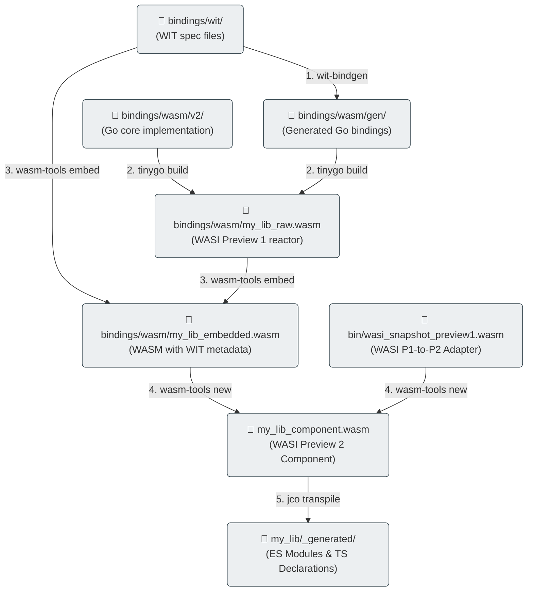

# Toolchain & Compilation Workflow

Compiling high-level Go code into WASI Preview 2 Components involves a multi-step compilation toolchain. This guide details the toolchain prerequisites, the compilation steps, and the automation configured in our [`Makefile`](file:///home/gpineda/Documents/ouvrage/labs/wasi-polyglot-bindings-reference/Makefile).

---

## 1. Toolchain Prerequisites

Because WASI Preview 2 is a modern ecosystem, standard compilation toolchains require specific versions. To prevent system-level dependency conflicts, our setup installs toolchain binaries locally inside the `bin/` folder of this repository:

*   **TinyGo (v0.31.2)**: Used for compiling Go code. TinyGo is required instead of standard Go because it produces much smaller WASM binaries and natively supports compiling reactor modules without garbage collection overhead.
*   **wit-bindgen (v0.24.0)**: Generates the low-level translation layers in Go, Python, and JS from the WIT interface description.
*   **wasm-tools (v1.200.0)**: Used to embed WIT metadata into the compiled WASM binary and translate the WASI Preview 1 binary into a WASI Preview 2 Component.
*   **Local Node.js (v22.12.0)**: Bundled in `bin/node/` to execute `jco` transpilation steps and run unit tests.

To boot the environment and download all tools locally, run:
```bash
make setup
```

Under the hood, this Makefile target delegates to the centralized bootstrap script [`tools/bootstrap-wasi.sh`](file:///home/gpineda/Documents/ouvrage/labs/wasi-polyglot-bindings-reference/tools/bootstrap-wasi.sh).

### 📥 Granular & Unit Toolchain Installation
To allow other repositories (like [`ouvrage-kern-go`](file:///home/gpineda/Documents/ouvrage/ouvrage-kern-go)) to reuse this toolchain setup without pulling in heavy, unnecessary runtimes like Node.js, the bootstrap script supports granular installation flags:

*   `--dir <path>`: Specifies the output directory for binaries (defaults to `./bin`).
*   `--tinygo`: Installs only TinyGo.
*   `--wit-bindgen`: Installs only the `wit-bindgen` CLI tool.
*   `--wasm-tools`: Installs only the `wasm-tools` CLI tool.
*   `--adapter`: Installs only the WASI `wasi_snapshot_preview1.wasm` reactor adapter.
*   `--node`: Installs only the Node.js runtime environment.
*   `--all` (default): Installs all five components.

For example, a purely Go-focused project can bootstrap its WASM compiler setup instantly using a single curl command while skipping Node.js:
```bash
curl -sSfL https://gitlab.com/ouvrage-systems/labs/wasi-polyglot-bindings-reference/-/raw/main/tools/bootstrap-wasi.sh \
  | bash -s -- --dir ./bin --tinygo --wit-bindgen --wasm-tools --adapter
```

---

## 2. Compilation Workflows

Our [`Makefile`](file:///home/gpineda/Documents/ouvrage/labs/wasi-polyglot-bindings-reference/Makefile) automates three separate targets representing the evolution of WebAssembly:

```text
  [v0: Pure WASM]  ──> TinyGo (-target=wasm) ──────────────────────────> my_lib_v0.wasm
  
  [v1: wasip1]     ──> Go Compiler (GOOS=wasip1 GOARCH=wasm) ─────────> my_lib.wasm
  
  [v2: wasip2]     ──> wit-bindgen ──> TinyGo ──> wasm-tools ──> jco ──> ESM Component
```

### A. V0 Compilation (Pure Browser WASM)
Compiles a stateless arithmetic Go package to browser-compatible WebAssembly MVP.
```bash
tinygo build -o bindings/js/v0/my_lib/_generated/my_lib_v0.wasm -target=wasm ./bindings/wasm/v0
```

### B. V1 Compilation (POSIX WASI Preview 1)
Compiles the JSON-RPC stdin/stdout subprocess runner.
```bash
GOOS=wasip1 GOARCH=wasm go build -o bindings/py/v1/my_lib/_generated/my_lib.wasm ./bindings/wasm/v1
```

### C. V2 Compilation (Component Model WASI Preview 2)
This is the most complex pipeline, consisting of 5 steps automated by `make build-wasm-v2`:



1.  **Generate Go WIT Bindings**:
    Runs `wit-bindgen` to parse the WIT specs directory `bindings/wit` and produce Go bindings inside `bindings/wasm/gen/`.
    ```bash
    wit-bindgen tiny-go ./bindings/wit --out-dir ./bindings/wasm/gen
    ```
2.  **Compile Go WASI Reactor**:
    TinyGo compiles the Go module into a WASI Preview 1 reactor binary (`my_lib_raw.wasm`). The target is `wasi` and the build uses `-no-debug` to reduce size.
    ```bash
    tinygo build -o ./bindings/wasm/my_lib_raw.wasm -target=wasi -no-debug ./bindings/wasm/v2
    ```
3.  **Embed WIT Metadata**:
    Runs `wasm-tools component embed` to inject the compiled WIT metadata directly into the WASM binary.
    ```bash
    wasm-tools component embed ./bindings/wit ./bindings/wasm/my_lib_raw.wasm -o ./bindings/wasm/my_lib_raw.wasm
    ```
4.  **Translate to V2 Component (The Adapter)**:
    Runs `wasm-tools component new` to translate the Preview 1 system calls (`wasip1`) into Preview 2 interface imports (`wasip2`). This step requires the adapter file [`wasi_snapshot_preview1.wasm`](file:///home/gpineda/Documents/ouvrage/labs/wasi-polyglot-bindings-reference/bin/wasi_snapshot_preview1.wasm) which acts as a bridge.
    ```bash
    wasm-tools component new ./bindings/wasm/my_lib_raw.wasm -o ./bindings/py/v2/my_lib/_generated/my_lib_component.wasm --adapt ./bin/wasi_snapshot_preview1.wasm
    ```
5.  **Transpile to ES Modules (for JavaScript Hosts)**:
    Runs `jco transpile` on the generated component to produce standard browser-compatible JavaScript ES Modules and TypeScript `.d.ts` declaration files.
    ```bash
    npx @bytecodealliance/jco transpile ./bindings/py/v2/my_lib/_generated/my_lib_component.wasm -o ./bindings/js/v2/my_lib/_generated
    ```

---

## 3. Customizing the Contract

If you need to extend or modify the library capabilities, you will update the interface contract files. Here is the step-by-step developer workflow to propagate changes through the decoupled architecture:

### Step 1: Update the WIT Specification (V2 Only)
1.  Modify or add `.wit` specification files inside [`bindings/wit/`](file:///home/gpineda/Documents/ouvrage/labs/wasi-polyglot-bindings-reference/bindings/wit/).
2.  Regenerate the Go type definitions by running:
    ```bash
    make build-wasm-v2
    ```
    *(Note: This step will temporarily fail at Step 2 of compilation because the Go code does not yet implement the new interface).*

### Step 2: Update the Go Implementations

*   **For WASI V2 (Component Model)**:
    1.  Update the specific module file inside [`bindings/wasm/v2/`](file:///home/gpineda/Documents/ouvrage/labs/wasi-polyglot-bindings-reference/bindings/wasm/v2/) (`geometry.go`, `store.go`, `lang.go`, or `network.go`) to match the new generated signatures from `bindings/wasm/gen/`.
    2.  If you added a completely new interface, register its implementation in the `init()` block of [`bindings/wasm/v2/main.go`](file:///home/gpineda/Documents/ouvrage/labs/wasi-polyglot-bindings-reference/bindings/wasm/v2/main.go).

*   **For WASI V1 (JSON-RPC)**:
    1.  Update the JSON-RPC handler callbacks inside [`bindings/wasm/v1/`](file:///home/gpineda/Documents/ouvrage/labs/wasi-polyglot-bindings-reference/bindings/wasm/v1/) (`geometry.go`, `store.go`, or `lang.go`) to handle the new method string and unpack/pack arguments.
    2.  If you added a new handler, register it in [`bindings/wasm/v1/main.go`](file:///home/gpineda/Documents/ouvrage/labs/wasi-polyglot-bindings-reference/bindings/wasm/v1/main.go).

### Step 3: Recompile and Verify
1.  Re-run the build to compile all targets and transpile JS modules:
    ```bash
    make build
    ```
2.  Verify your changes by running the test suites:
    ```bash
    make test
    ```

---

## 4. Future Outlook: WASI Preview 3 (0.3.0)

While this Reference Lab locks onto **WASI Preview 2 (0.2.0)** for production-ready stability, we are actively tracking the evolution of the next major specification: **WASI Preview 3 (`0.3.0`)**.

### Main Shift: Native Asynchrony
The defining feature of WASI Preview 3 is the introduction of **first-class async capabilities (Futures and Streams)** at the WebAssembly Component Model boundary. In Preview 2, calling an import interface (such as a network socket or file read) is synchronous and blocking. Preview 3 will allow non-blocking, async/await operations natively across language boundaries (e.g., a JavaScript async event loop calling an asynchronous WASM guest without thread blocking).

### Go & TinyGo Compiler Ecosystem Constraints
We do not adopt WASI Preview 3 in the current workspace due to early-stage compiler support:

1.  **TinyGo Scheduler**: Mapping Go goroutines and channels to WASM native async promises requires rewriting TinyGo's internal runtime scheduler. This is an active research area under the Bytecode Alliance but is not yet stable.
2.  **Standard Go**: The official Go compiler (`gc`) is still consolidating its Preview 1 (`wasip1`) and Preview 2 targets. Native Preview 3 support is not yet ready for general use.
3.  **Host Runtimes**: Node.js and Python `wasmtime` binders are currently focused on stabilizing their Preview 2 component APIs; Preview 3 async bindings are still in experimental draft stages.

Ouvrage Systems will monitor the compiler maturity and plan a migration path to Preview 3 once TinyGo's async scheduling engine reaches stable release status.

