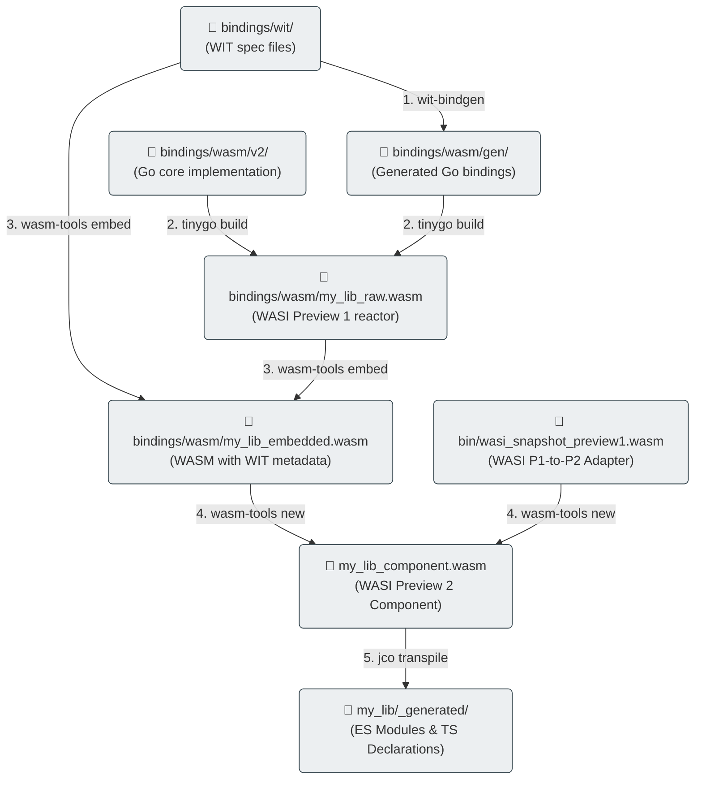

# Toolchain & Compilation Workflow

Compiling high-level Go code into WASI Preview 2 Components involves a multi-step compilation toolchain. This guide details the toolchain prerequisites, the compilation steps, and the automation configured in our [`Makefile`](file:///home/gpineda/Documents/ouvrage/labs/wasi-polyglot-bindings-reference/Makefile).

---

## 1. Toolchain Prerequisites

Because WASI Preview 2 is a modern ecosystem, standard compilation toolchains require specific versions. To prevent system-level dependency conflicts, our setup installs toolchain binaries locally inside the `bin/` folder of this repository:

*   **TinyGo (v0.31.2)**: Used for compiling Go code. TinyGo is required instead of standard Go because it produces much smaller WASM binaries and natively supports compiling reactor modules without garbage collection overhead.
*   **wit-bindgen (v0.24.0)**: Generates the low-level translation layers in Go, Python, and JS from the WIT interface description.
*   **wasm-tools (v1.200.0)**: Used to embed WIT metadata into the compiled WASM binary and translate the WASI Preview 1 binary into a WASI Preview 2 Component.
*   **Local Node.js (v22.12.0)**: Bundled in `bin/node/` to execute `jco` transpilation steps and run unit tests.

To boot the environment and download all tools locally, run:
```bash
make setup
```

Under the hood, this Makefile target delegates to the centralized bootstrap script [`tools/bootstrap-wasi.sh`](file:///home/gpineda/Documents/ouvrage/labs/wasi-polyglot-bindings-reference/tools/bootstrap-wasi.sh).

### 📥 Granular & Unit Toolchain Installation
To allow other repositories (like [`ouvrage-kern-go`](file:///home/gpineda/Documents/ouvrage/ouvrage-kern-go)) to reuse this toolchain setup without pulling in heavy, unnecessary runtimes like Node.js, the bootstrap script supports granular installation flags:

*   `--dir <path>`: Specifies the output directory for binaries (defaults to `./bin`).
*   `--tinygo`: Installs only TinyGo.
*   `--wit-bindgen`: Installs only the `wit-bindgen` CLI tool.
*   `--wasm-tools`: Installs only the `wasm-tools` CLI tool.
*   `--adapter`: Installs only the WASI `wasi_snapshot_preview1.wasm` reactor adapter.
*   `--node`: Installs only the Node.js runtime environment.
*   `--all` (default): Installs all five components.

For example, a purely Go-focused project can bootstrap its WASM compiler setup instantly using a single curl command while skipping Node.js:
```bash
curl -sSfL https://gitlab.com/ouvrage-systems/labs/wasi-polyglot-bindings-reference/-/raw/main/tools/bootstrap-wasi.sh \
  | bash -s -- --dir ./bin --tinygo --wit-bindgen --wasm-tools --adapter
```

---

## 2. Compilation Workflows

Our [`Makefile`](file:///home/gpineda/Documents/ouvrage/labs/wasi-polyglot-bindings-reference/Makefile) automates three separate targets representing the evolution of WebAssembly:

```text
  [v0: Pure WASM]  ──> TinyGo (-target=wasm) ──────────────────────────> my_lib_v0.wasm
  
  [v1: wasip1]     ──> Go Compiler (GOOS=wasip1 GOARCH=wasm) ─────────> my_lib.wasm
  
  [v2: wasip2]     ──> wit-bindgen ──> TinyGo ──> wasm-tools ──> jco ──> ESM Component
```

### A. V0 Compilation (Pure Browser WASM)

WebAssembly in Go has evolved through two distinct architectural paradigms:

1.  **Legacy Go WASM (`GOOS=js GOARCH=wasm`)**: Introduced in Go 1.11, this target embeds the full Go runtime, goroutine scheduler, and garbage collector. It produces large binaries (~2.4 MB minimal size) that require the official `wasm_exec.js` bridge script, import the `"gojs"` namespace, and register functions dynamically at runtime using `syscall/js`.
2.  **TinyGo Micro WASM (`-target=wasm`)**: Designed for lightweight browser modules. It compiles stateless Go packages to pure WebAssembly 1.0 (MVP 2017) binaries of minuscule size (~10 KB) that export direct C-style functions (`//export Add`) callable without `wasm_exec.js`.

For our V0 standalone arithmetic module, we use TinyGo with a simplified standalone entrypoint:

```go title="./bindings/wasm/v0/tiny/main.go"
package main

//export Add
func Add(a, b int32) int32 {
	return a + b
}

func main() {
	// Standalone Go WASM target requires a main function but it remains inactive.
}
```

#### 🛠️ Dissecting the TinyGo Compilation Pipeline (`-x`)

Executing `tinygo build` with the execution trace flag (`-x`) exposes the raw LLVM compiler pipeline:

```bash
$ GOWORK=off ./bin/tinygo/bin/tinygo build -x -o bindings/build/v0/tiny/my_lib.wasm -target=wasm ./bindings/wasm/v0/tiny/
wasm-ld --allow-undefined-file=/home/gpineda/Documents/ouvrage/labs/wasi-polyglot-bindings-reference/bin/packages/tinygo/0.41.1/targets/wasm-undefined.txt --stack-first --no-demangle -L /home/gpineda/Documents/ouvrage/labs/wasi-polyglot-bindings-reference/bin/packages/tinygo/0.41.1 -o /tmp/tinygo4013741042/main /tmp/tinygo4013741042/main.o /home/gpineda/.cache/tinygo/compiler-rt-wasm32-unknown-wasi-generic/lib.a /home/gpineda/.cache/tinygo/obj-fbac5ade9c65ab66f536a15d10b5278077e3b5dc84a664fe12d95a51.bc /home/gpineda/.cache/tinygo/obj-ee58115c57b2d37791bcff4d30499cfc52f98c831a80379f00c43dc3.bc /home/gpineda/.cache/tinygo/obj-bb40f64f6028efde80fb8ab8e27477845d218af84c0043a4897c814d.bc /home/gpineda/.cache/tinygo/wasi-libc-wasm32-unknown-wasi-generic/lib.a -mllvm -mcpu=generic -mllvm -mattr=+bulk-memory,+bulk-memory-opt,+call-indirect-overlong,+mutable-globals,+nontrapping-fptoint,+sign-ext,-multivalue,-reference-types --lto-O2 --thinlto-cache-dir=/home/gpineda/.cache/tinygo/thinlto -mllvm --rotation-max-header-size=0
/home/gpineda/Documents/ouvrage/labs/wasi-polyglot-bindings-reference/bin/packages/tinygo/0.41.1/bin/wasm-opt --asyncify -Oz -g /tmp/tinygo4013741042/main --output /tmp/tinygo4013741042/main.wasmopt
```

This trace highlights the two core post-processing stages executed by TinyGo:

1.  **WebAssembly Linker (`wasm-ld`)**:
    TinyGo invokes the LLVM linker (`wasm-ld`), passing the target-specific undefined symbol whitelist `--allow-undefined-file=.../targets/wasm-undefined.txt`.
    
    ```txt title="./bin/packages/tinygo/0.41.1/targets/wasm-undefined.txt"
    syscall/js.copyBytesToGo
    syscall/js.copyBytesToJS
    syscall/js.finalizeRef
    syscall/js.stringVal
    syscall/js.valueCall
    ...
    syscall/js.valueSetIndex
    ```
    
    This whitelist instructs `wasm-ld` to permit unresolved `syscall/js.*` symbols without raising link-time errors. However, because our Go code performs pure arithmetic without referencing `syscall/js`, LLVM's **Dead Code Elimination (DCE)** phase strips all unused `syscall/js.*` functions from the final output.

2.  **Binaryen Post-Optimization (`wasm-opt`)**:
    TinyGo passes the linked WASM module through `wasm-opt` with size optimization (`-Oz`) and `--asyncify` passes:
    ```bash
    wasm-opt --asyncify -Oz -g /tmp/tinygo1234/main --output /tmp/tinygo1234/main.wasmopt
    ```

#### 🔍 WAT Disassembly Analysis (`wasm-tools print`)

Inspecting the compiled `my_lib.wasm` imports shows that only three essential runtime stubs remain:

```bash
$ ./bin/wasm-tools print bindings/build/v0/tiny/my_lib.wasm | grep import
(import "wasi_snapshot_preview1" "proc_exit" (func $runtime.proc_exit (;0;) (type 0)))
(import "wasi_snapshot_preview1" "fd_write" (func $runtime.fd_write (;1;) (type 3)))
(import "wasi_snapshot_preview1" "random_get" (func $__imported_wasi_snapshot_preview1_random_get (;2;) (type 2)))
```

> **Note**: TinyGo uses the `"wasi_snapshot_preview1"` namespace for these three internal runtime stubs (`proc_exit` for panic handling, `fd_write` for debug output, and `random_get` for map hashing seed entropy) to unify its low-level runtime across browser and WASI targets.

Inspecting the exported `Add` function with `wasm-tools print` reveals how TinyGo wraps the Go implementation:

```bash
$ ./bin/wasm-tools print bindings/build/v0/tiny/my_lib.wasm | awk '/func \$Add/,/^\s*\)/'
(func $Add (;61;) (type 2) (param i32 i32) (result i32)
  local.get 0
  local.get 1
  i32.add
)
(func $Add.command_export (;73;) (type 2) (param i32 i32) (result i32)
  (local i32)
  local.get 0
  local.get 1
  call $Add
  local.set 2
  call $__wasm_call_dtors
  local.get 2
)
(export "Add" (func $Add.command_export))
```

*   **`$Add`**: The pure Go arithmetic implementation containing the native WebAssembly `i32.add` opcode.
*   **`$Add.command_export`**: A C-ABI command wrapper generated by TinyGo. When invoked from JavaScript (`instance.exports.Add`), it passes parameters to `$Add`, executes `$__wasm_call_dtors` to clean up temporary allocations, and returns the result `i32`.


```go title="pkg/maths/maths.go"
// ComputeSequence computes an arithmetic sequence Un = U0 + n * b using 64-bit integers.
// Demonstrates LLVM scalar loop vectorization / constant reduction.
func ComputeSequence(u0, b, n int64) int64 {
	curr := u0
	for i := int64(0); i < n; i++ {
		curr = Add(curr, b)
	}
	return curr
}
```

```
gpineda@thinkpad-e15g2:~/Documents/ouvrage/labs/wasi-polyglot-bindings-reference$ ./bin/wasm-tools print bindings/build/v0/tiny/my_lib.wasm | grep -A 35 "func \$ComputeSequence"
  (func $ComputeSequence (;53;) (type 13) (param i64 i64 i64) (result i64)
    local.get 2
    i64.const 0
    local.get 2
    i64.const 0
    i64.gt_s
    select
    local.get 1
    i64.mul         ;; N * B
    local.get 0     
    i64.add         ;; U0 + (N * B)

  )
--
  (func $ComputeSequence.command_export (;70;) (type 13) (param i64 i64 i64) (result i64)
    (local i64)
    local.get 0
    local.get 1
    local.get 2
    call $ComputeSequence
    local.set 3
    call $__wasm_call_dtors
    local.get 3
  )
```
> LLVM SCEV (Scalar Evolution): scalar loop vectorization and constant reduction optimizations are applied to the arithmetic sequence computation, resulting in a single `i64.mul` and `i64.add` operation instead of an explicit loop.


#### 🌐 The Host Loader Role: Mocking WASI Imports in the Browser

Because Web browsers do not natively implement WASI system calls, calling `WebAssembly.instantiateStreaming` directly on `my_lib.wasm` without an import object would fail at runtime with a `LinkError`.

Our lightweight loader ([`bindings/js/v0/tiny/my_lib/_generated/loader.js`](file:///home/gpineda/Documents/ouvrage/labs/wasi-polyglot-bindings-reference/bindings/js/v0/tiny/my_lib/_generated/loader.js)) acts as an intentional **JS-side mock shim**. It provides a 10-line `mockWasiEnv` object that satisfies TinyGo's three required imports (`proc_exit`, `fd_write`, `random_get`) using browser-native APIs (`crypto.getRandomValues`) without pulling in heavy polyfill frameworks:

```javascript
const mockWasiEnv = {
  proc_exit: (code) => console.warn(`WASM exit: ${code}`),
  fd_write: (fd, iovs, iovs_len, nwritten) => 0,
  random_get: (buf, buf_len) => {
    if (wasmMemory) crypto.getRandomValues(new Uint8Array(wasmMemory.buffer, buf, buf_len));
    return 0;
  }
};

// Satisfies the WASM engine instantiation requirement
const importObject = { wasi_snapshot_preview1: mockWasiEnv };
```

This encapsulates all low-level WASM instantiation mechanics inside `_generated/loader.js`, allowing the frontend application ([`index.html`](file:///home/gpineda/Documents/ouvrage/labs/wasi-polyglot-bindings-reference/bindings/js/v0/tiny/index.html)) to consume pure, clean ES Modules without any WASM boilerplate:

```html
<script type="module">
    import { add } from './my_lib/index.js';
    const result = await add(15, 35);
    console.log("Result:", result); // Output: 50
</script>
```


#### 🏛️ Comparative Analysis: Legacy Go WASM (`v0/legacy`)

For educational contrast, our repository also includes the **Legacy Go WASM** target (`GOOS=js GOARCH=wasm`).

Unlike TinyGo's direct `//export` mechanism, standard Go does not export WebAssembly functions directly to the binary's export table. Instead, it registers functions dynamically at runtime using `syscall/js`:

```go title="./bindings/wasm/v0/legacy/main.go"
package main

import "syscall/js"

func add(this js.Value, args []js.Value) any {
	a := args[0].Int()
	b := args[1].Int()
	return a + b
}

func main() {
	// Register the Go function in the global JS scope (window.add)
	js.Global().Set("add", js.FuncOf(add))

	// Block main goroutine to keep the runtime active
	select {}
}
```

When inspecting the WAT disassembly of `v0/legacy/my_lib.wasm`, imports belong to the `"gojs"` namespace rather than WASI:

```bash
$ ./bin/wasm-tools print bindings/build/v0/legacy/my_lib.wasm | grep import
(import "gojs" "runtime.scheduleTimeoutEvent" (func (;0;) (type 1)))
(import "gojs" "runtime.clearTimeoutEvent" (func (;1;) (type 1)))
(import "gojs" "runtime.wasmWrite" (func (;3;) (type 1)))
(import "gojs" "runtime.getRandomData" (func (;4;) (type 1)))
(import "gojs" "runtime.wasmExit" (func (;6;) (type 6)))
```

Executing Legacy Go WASM requires loading Go's official `wasm_exec.js` runtime bridge:

```html
<!-- Requires official Go runtime bridge -->
<script src="wasm_exec.js"></script>
<script type="module">
    const go = new Go();
    const { instance } = await WebAssembly.instantiateStreaming(fetch('my_lib.wasm'), go.importObject);
    go.run(instance); // Executes main() and registers window.add
    console.log(window.add(15, 35)); // 50
</script>
```

| Metric / Feature | TinyGo Micro WASM (`v0/tiny`) | Legacy Go WASM (`v0/legacy`) |
| :--- | :--- | :--- |
| **Compiler** | TinyGo (`-target=wasm`) | Standard Go (`GOOS=js GOARCH=wasm`) |
| **Binary Footprint** | **~10 KB** | **~2.4 MB** |
| **Export Model** | Native WASM `(export "Add")` | Dynamic JS Injection (`syscall/js`) |
| **JS Bridge Dependency** | None (10-line mock loader) | Required (`wasm_exec.js`) |
| **Import Namespace** | `"wasi_snapshot_preview1"` | `"gojs"` |


### B. V1 Compilation (POSIX WASI Preview 1)
Compiles the JSON-RPC stdin/stdout subprocess runner.
```bash
GOOS=wasip1 GOARCH=wasm go build -o bindings/py/v1/my_lib/_generated/my_lib.wasm ./bindings/wasm/v1
```

### C. V2 Compilation (Component Model WASI Preview 2)
This is the most complex pipeline, consisting of 5 steps automated by `make build-wasm-v2`:



1.  **Generate Go WIT Bindings**:
    Runs `wit-bindgen` to parse the WIT specs directory `bindings/wit` and produce Go bindings inside `bindings/wasm/gen/`.
    ```bash
    wit-bindgen tiny-go ./bindings/wit --out-dir ./bindings/wasm/gen
    ```
2.  **Compile Go WASI Reactor**:
    TinyGo compiles the Go module into a WASI Preview 1 reactor binary (`my_lib_raw.wasm`). The target is `wasi` and the build uses `-no-debug` to reduce size.
    ```bash
    tinygo build -o ./bindings/wasm/my_lib_raw.wasm -target=wasi -no-debug ./bindings/wasm/v2
    ```
3.  **Embed WIT Metadata**:
    Runs `wasm-tools component embed` to inject the compiled WIT metadata directly into the WASM binary.
    ```bash
    wasm-tools component embed ./bindings/wit ./bindings/wasm/my_lib_raw.wasm -o ./bindings/wasm/my_lib_raw.wasm
    ```
4.  **Translate to V2 Component (The Adapter)**:
    Runs `wasm-tools component new` to translate the Preview 1 system calls (`wasip1`) into Preview 2 interface imports (`wasip2`). This step requires the adapter file [`wasi_snapshot_preview1.wasm`](file:///home/gpineda/Documents/ouvrage/labs/wasi-polyglot-bindings-reference/bin/wasi_snapshot_preview1.wasm) which acts as a bridge.
    ```bash
    wasm-tools component new ./bindings/wasm/my_lib_raw.wasm -o ./bindings/py/v2/my_lib/_generated/my_lib_component.wasm --adapt ./bin/wasi_snapshot_preview1.wasm
    ```
5.  **Transpile to ES Modules (for JavaScript Hosts)**:
    Runs `jco transpile` on the generated component to produce standard browser-compatible JavaScript ES Modules and TypeScript `.d.ts` declaration files.
    ```bash
    npx @bytecodealliance/jco transpile ./bindings/py/v2/my_lib/_generated/my_lib_component.wasm -o ./bindings/js/v2/my_lib/_generated
    ```

---

## 3. Customizing the Contract

If you need to extend or modify the library capabilities, you will update the interface contract files. Here is the step-by-step developer workflow to propagate changes through the decoupled architecture:

### Step 1: Update the WIT Specification (V2 Only)
1.  Modify or add `.wit` specification files inside [`bindings/wit/`](file:///home/gpineda/Documents/ouvrage/labs/wasi-polyglot-bindings-reference/bindings/wit/).
2.  Regenerate the Go type definitions by running:
    ```bash
    make build-wasm-v2
    ```
    *(Note: This step will temporarily fail at Step 2 of compilation because the Go code does not yet implement the new interface).*

### Step 2: Update the Go Implementations

*   **For WASI V2 (Component Model)**:
    1.  Update the specific module file inside [`bindings/wasm/v2/`](file:///home/gpineda/Documents/ouvrage/labs/wasi-polyglot-bindings-reference/bindings/wasm/v2/) (`geometry.go`, `store.go`, `lang.go`, or `network.go`) to match the new generated signatures from `bindings/wasm/gen/`.
    2.  If you added a completely new interface, register its implementation in the `init()` block of [`bindings/wasm/v2/main.go`](file:///home/gpineda/Documents/ouvrage/labs/wasi-polyglot-bindings-reference/bindings/wasm/v2/main.go).

*   **For WASI V1 (JSON-RPC)**:
    1.  Update the JSON-RPC handler callbacks inside [`bindings/wasm/v1/`](file:///home/gpineda/Documents/ouvrage/labs/wasi-polyglot-bindings-reference/bindings/wasm/v1/) (`geometry.go`, `store.go`, or `lang.go`) to handle the new method string and unpack/pack arguments.
    2.  If you added a new handler, register it in [`bindings/wasm/v1/main.go`](file:///home/gpineda/Documents/ouvrage/labs/wasi-polyglot-bindings-reference/bindings/wasm/v1/main.go).

### Step 3: Recompile and Verify
1.  Re-run the build to compile all targets and transpile JS modules:
    ```bash
    make build
    ```
2.  Verify your changes by running the test suites:
    ```bash
    make test
    ```

---

## 4. Future Outlook: WASI Preview 3 (0.3.0)

While this Reference Lab locks onto **WASI Preview 2 (0.2.0)** for production-ready stability, we are actively tracking the evolution of the next major specification: **WASI Preview 3 (`0.3.0`)**.

### Main Shift: Native Asynchrony
The defining feature of WASI Preview 3 is the introduction of **first-class async capabilities (Futures and Streams)** at the WebAssembly Component Model boundary. In Preview 2, calling an import interface (such as a network socket or file read) is synchronous and blocking. Preview 3 will allow non-blocking, async/await operations natively across language boundaries (e.g., a JavaScript async event loop calling an asynchronous WASM guest without thread blocking).

### Go & TinyGo Compiler Ecosystem Constraints
We do not adopt WASI Preview 3 in the current workspace due to early-stage compiler support:

1.  **TinyGo Scheduler**: Mapping Go goroutines and channels to WASM native async promises requires rewriting TinyGo's internal runtime scheduler. This is an active research area under the Bytecode Alliance but is not yet stable.
2.  **Standard Go**: The official Go compiler (`gc`) is still consolidating its Preview 1 (`wasip1`) and Preview 2 targets. Native Preview 3 support is not yet ready for general use.
3.  **Host Runtimes**: Node.js and Python `wasmtime` binders are currently focused on stabilizing their Preview 2 component APIs; Preview 3 async bindings are still in experimental draft stages.

Ouvrage Systems will monitor the compiler maturity and plan a migration path to Preview 3 once TinyGo's async scheduling engine reaches stable release status.

